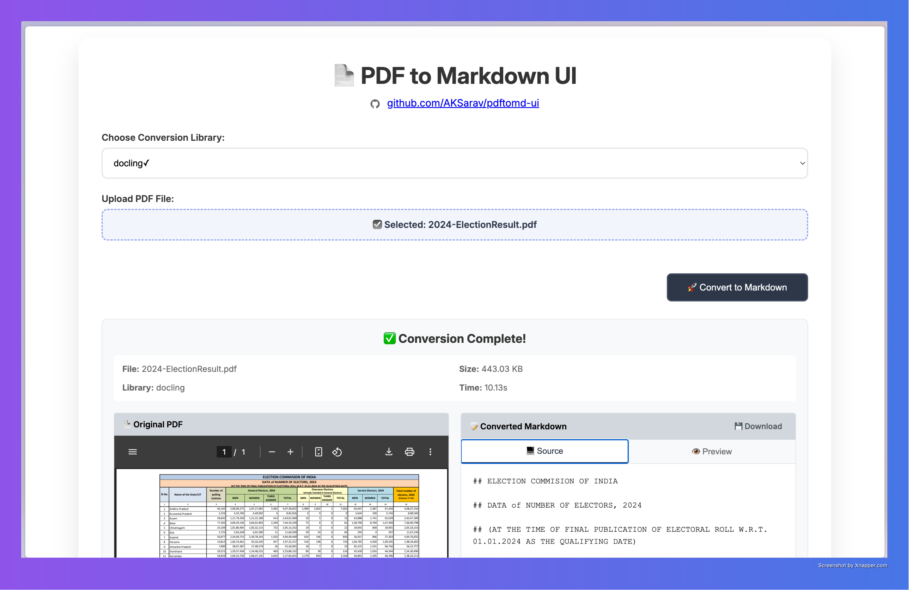

# PDF to Markdown Converter - PDFstract

A beautiful web application built with FastAPI and HTML that converts PDF files to Markdown format using various conversion libraries.



## Features

- 🚀 **Multiple Conversion Libraries**: Support for `pymupdf4llm`, `markitdown`, `marker`, and `docling`
- 📱 **Modern UI**: Beautiful, responsive design with drag-and-drop file upload
- ⚡ **Fast Processing**: Efficient backend processing with real-time feedback
- 🔄 **Library Status**: Dynamic checking of available libraries
- 📄 **Preview Results**: View converted Markdown content directly in the browser

## Libraries Supported

1. **pymupdf4llm** (`>=0.0.26`) - Fast PDF text extraction with PyMuPDF
2. **markitdown** (`>=0.1.2`) - Microsoft's document conversion tool
3. **marker** (`>=1.8.1`) - Advanced PDF to Markdown conversion with ML
4. **docling** (`>=2.41.0`) - IBM's document intelligence platform

## Installation

### Prerequisites

- Python 3.8 or higher
- UV (fast Python package installer)

### Setup

1. **Clone or download the project files**

2. **Install dependencies**:
   ```bash
   uv sync
   ```
   
   Or if you don't have a virtual environment:
   ```bash
   uv pip install -r requirements.txt
   ```

   Note: Some libraries may require additional system dependencies:
   
   - **For marker**: May require additional ML dependencies
   - **For docling**: May require specific Python versions and dependencies
   - **For pymupdf4llm**: Should work out of the box
   - **For markitdown**: May require additional dependencies for certain file types

3. **Verify installation** (optional):
   ```bash
   uv run python -c "import fastapi; print('FastAPI installed successfully')"
   ```

## Running the Application

1. **Start the server**:
   ```bash
   uv run python main.py
   ```
   
   Or alternatively:
   ```bash
   uv run uvicorn main:app --host 0.0.0.0 --port 8000 --reload
   ```

2. **Open your browser** and navigate to:
   ```
   http://localhost:8000
   ```

3. **Use the application**:
   - Select a conversion library from the dropdown
   - Upload a PDF file (drag-and-drop or click to select)
   - Click "Convert to Markdown"
   - View the converted result

## Running with Docker

This project includes a `Dockerfile` and `docker-compose.yml` for easy containerization.

1.  **Build and run the container**:
    ```bash
    docker-compose up --build
    ```

2.  **Open your browser** and navigate to:
    ```
    http://localhost:8000
    ```

This will start the application inside a Docker container, accessible on port 8000.

## API Endpoints

- `GET /` - Main web interface
- `GET /health` - Health check endpoint
- `GET /libraries` - Get available conversion libraries
- `POST /convert` - Convert PDF to Markdown

### API Usage Example

```bash
# Check available libraries
curl http://localhost:8000/libraries

# Convert a PDF file
curl -X POST \
  -F "file=@your-file.pdf" \
  -F "library=pymupdf4llm" \
  http://localhost:8000/convert
```

## Troubleshooting

### Library Installation Issues

If you encounter issues with specific libraries:

1. **pymupdf4llm**: Usually installs without issues
   ```bash
   uv add pymupdf4llm
   ```

2. **markitdown**: May need Microsoft Build Tools on Windows
   ```bash
   uv add markitdown
   ```

3. **marker**: Requires additional ML dependencies
   ```bash
   uv add marker-pdf
   ```

4. **docling**: May have specific version requirements
   ```bash
   uv add docling
   ```

### Common Issues

- **"Library not available"**: The library failed to import. Check the installation.
- **"Conversion failed"**: The selected library couldn't process your PDF. Try a different library.
- **Large file timeout**: Some libraries may take longer for large files.

### Performance Tips

- **pymupdf4llm**: Fastest for simple text extraction
- **markitdown**: Good balance of speed and quality
- **marker**: Best quality but slower, especially on first run
- **docling**: Advanced features but may be slower

## Development

### Project Structure

```
pdftomd-ui/
├── main.py              # FastAPI application
├── requirements.txt     # Python dependencies
├── templates/
│   └── index.html      # Web interface
├── uploads/            # Temporary upload directory (auto-created)
└── README.md           # This file
```

### Adding New Libraries

To add support for additional conversion libraries:

1. Add the library to `requirements.txt`
2. Import it in `main.py` with try/except
3. Add it to the `get_available_libraries()` function
4. Create a conversion function following the existing pattern
5. Add it to the conversion logic in `/convert` endpoint

## License

This project is provided as-is for educational and development purposes.

## Contributing

Feel free to submit issues and enhancement requests! 
